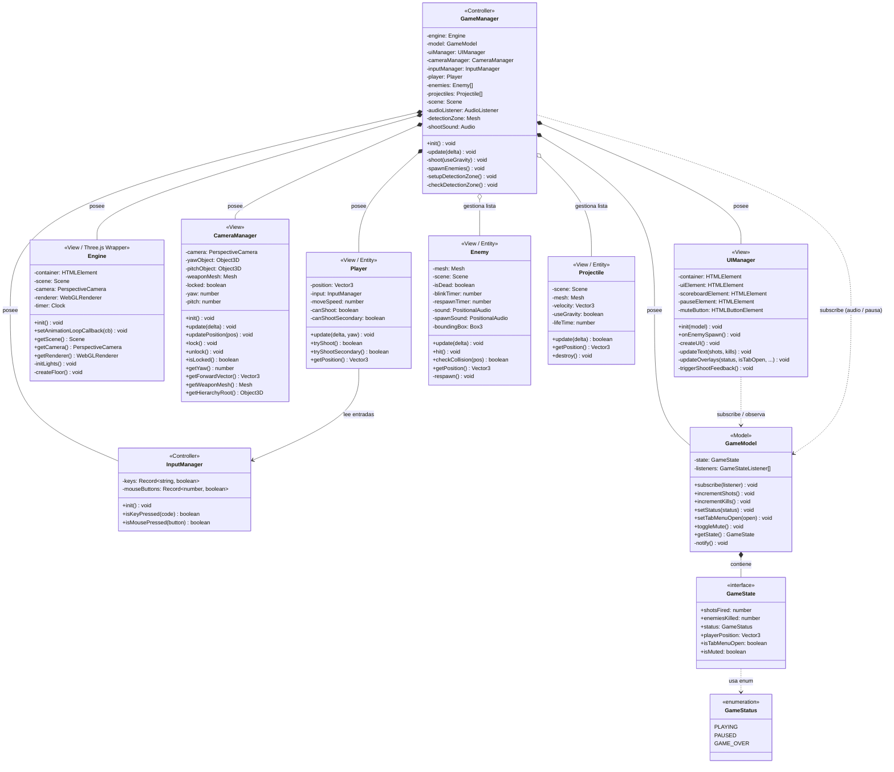

# Diagrama UML — FPShooterNuevo



---

## Leyenda de relaciones

| Símbolo | Tipo            | Significado                                                                 |
| ------- | --------------- | --------------------------------------------------------------------------- |
| `*--`   | **Composición** | La clase padre crea y destruye la instancia hija                            |
| `o--`   | **Agregación**  | La clase padre gestiona la colección, pero las entidades tienen vida propia |
| `-->`   | **Asociación**  | Referencia directa entre clases                                             |
| `..>`   | **Dependencia** | Uso puntual (callback / suscripción)                                        |

## Capas MVC

```
┌─ Controller ──────────────────────────────────┐
│  GameManager   InputManager                   │
└───────────────────────────────────────────────┘
          │ observa          │ controla
┌─ Model ─┘        ┌─ View ──┴─────────────────┐
│  GameModel        │  Engine    CameraManager  │
│  GameState        │  UIManager Player         │
│  GameStatus       │  Enemy     Projectile     │
└───────────────    └───────────────────────────┘
```
